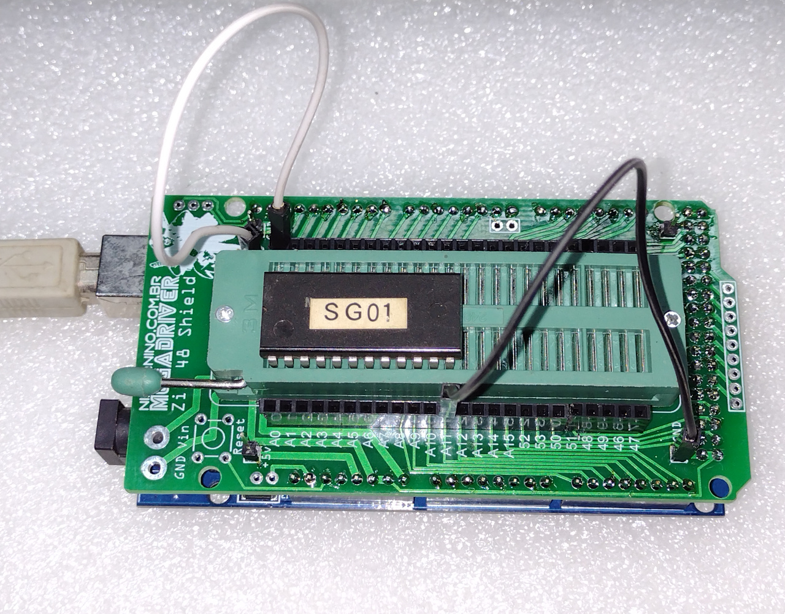

# Arduino Mega PROM dumper
Arduino MEGA sketch for dumping old PROMs chips.

Currently supported chips:  
82s123, 82s129, 82s141, 6348, 6349, mb7054, mb7123  

Check the *.hpp files for pin configuration for each device. Use the Arduino IDE serial console
for text based dumping or the included linux console tool to save binary dumps.  

For ease of use I've created a Zif48 shield and provided the Gerbers for it:  
  

